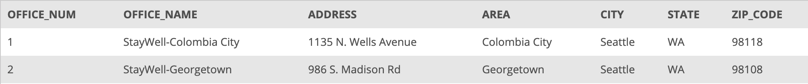
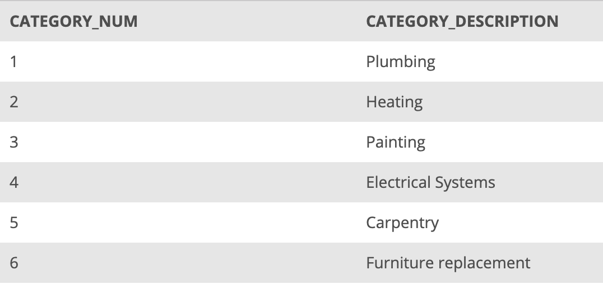
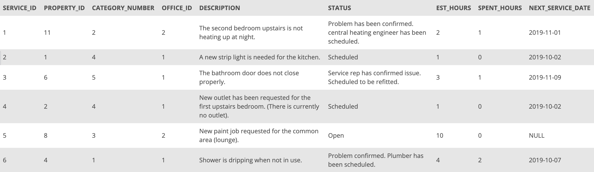
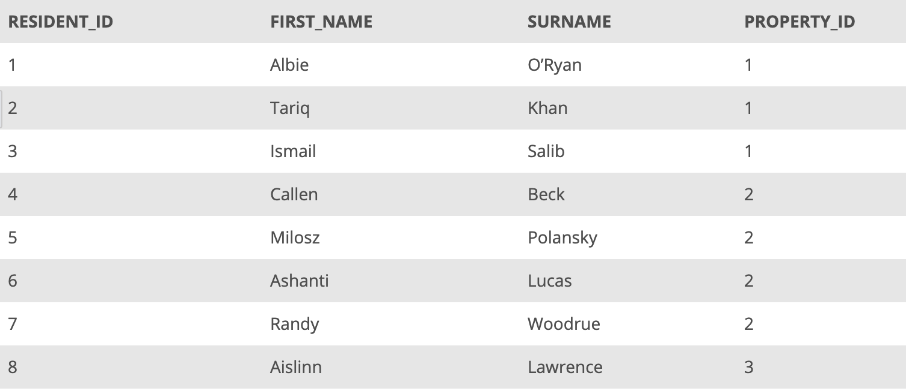
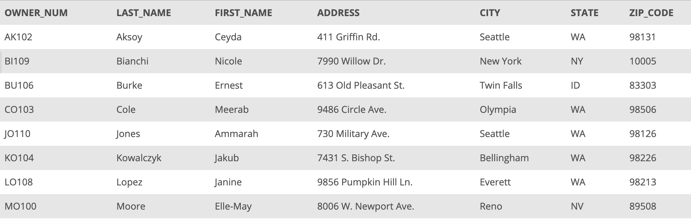
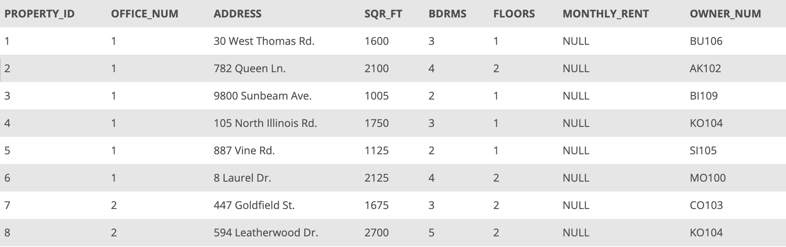

## Scenario

StayWell focuses on finding and managing accommodation for owners of student accommodation in the Seattle area. Currently, it operates in two main areas of the city with separate administrative offices: Colombia City and Georgetown. StayWell rents out 1 to 5-bedroom properties to students on behalf of property owner 7.

You are assigned, as the database administrator, to collect and manage transactional data of StayWell’s operations. You will begin by creating the database and tables for StayWell and will transfer the collected data. Then, you will need to execute further database operations as StayWell’s operations expand.

The current database contains the following tables: `OFFICE`, `SERVICE_CATEGORY`, `SERVICE_REQUEST`, `RESIDENTS`, `OWNER`, and `PROPERTY`.

The `OFFICE` table contains information about the two StayWell office locations, including the office number, office name, and address.

_OFFICE table_

The `SERVICE_CATEGORY` table contains information regarding the different service categories, such as their numerical designation and description.

_SERVICE_CATEGORY table_

The `SERVICE_REQUEST` table contains information on service requests for each property. The `SERVICE_REQUEST` table stores the service ID, property ID, service category number, the managing office ID, request description, the request's status, estimated hours, hours spent, and the service date.

_SERVICE_REQUEST table_

The `RESIDENTS` table contains the information on each resident, such as their resident ID, first name, surname (last name), and property ID.

_RESIDENTS table_

The `OWNER` table contains information on each property owner, such as their owner number (ID), last name, first name, and address.

_OWNER table_

The `PROPERTY` table contains information on each property, including the property ID, managing office number, address, square feet, bedrooms, floors, monthly rent, and the owner.

_PROPERTY table_

## Project Objectives

- Retrieve data from multiple tables
- Join the table itself and run additional checks over the rows
- Use set operations to combine data from multiple tables
- Change the structure of an existing table
- Add new data to existing tables
- Use transactions to make data updates and revert the updates

## Best practices to follow:

- Write detailed comments for SQL statements.
- Organize and structure SQL statements for readability.

## Your tasks are as follows:
