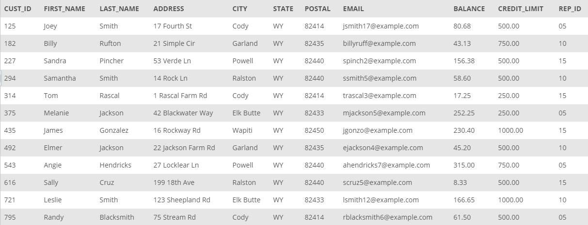
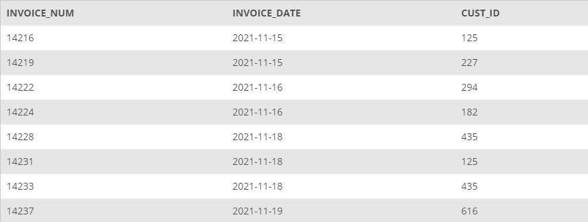
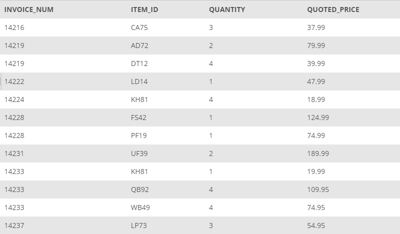
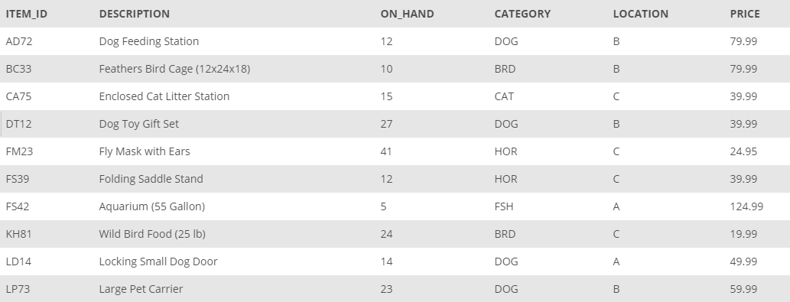
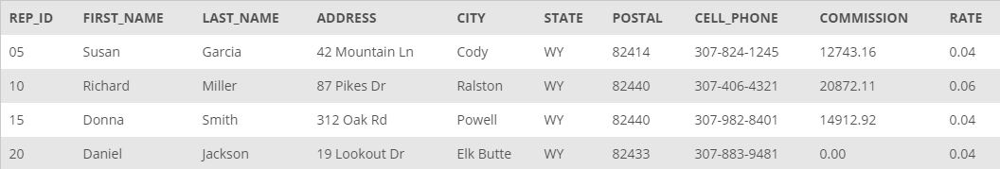

## Database Model: KimTay
The management of KimTay Pet Supplies (a supplier of pet supplies, food, and accessories located in Cody, Wyoming) has determined that the company’s recent growth no longer makes it feasible to maintain customer, invoice, and inventory data using its manual systems. In addition, KimTay Pet Supplies wants to build an Internet presence. With the data stored in a database, management will be able to ensure that the data is up-to-date and more accurate than in the current manual systems. In addition, managers will be able to obtain answers to their questions concerning the data in the database easily and quickly, with the option of producing a variety of useful reports.

The `CUSTOMER` table maintains information about each customer, such as their ID, first and last name, address, balance, and credit limit. 

*CUSTOMER table*

In the `INVOICES` table contains information about each invoice, such as the invoice number, date, and the customer being invoiced. 

*INVOICES table*

The `INVOICE_LINE` table has the itemized information for each invoice. This includes the item ids, quantity, and price for each invoice.

*INVOICE_LINE table*

The `ITEM` table has a information pertaining to each item for sale by KimTay's Pet Supplies. This includes a description, the number in stock, location, and price. 

*ITEM table*

The `SALES_REP` table includes the information for each sales representative for KimTay's Pet Supplies. This includes first and last name, address, cell-phone, commission, and commission rate. 

*SALES_REP table*
