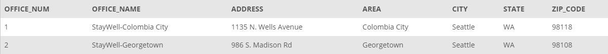
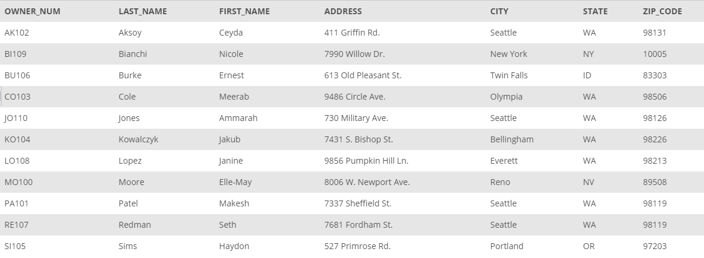
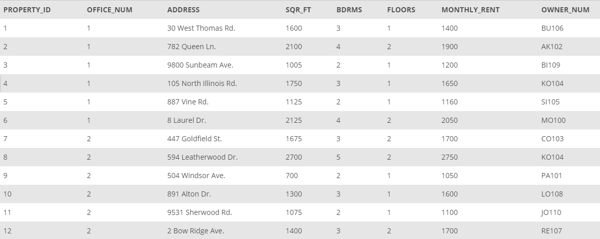
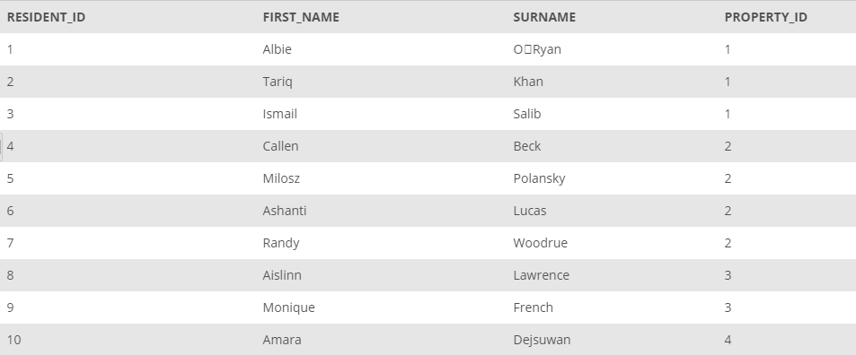
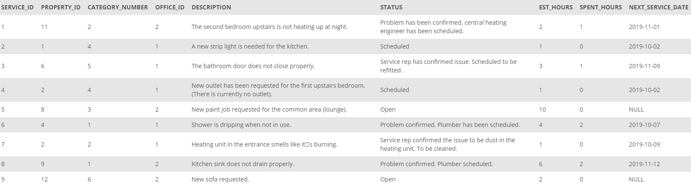
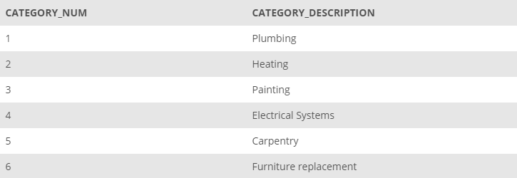

## Database Model: StayWell

Staywell finds and manages accommodation for owners of student accommodation in the Seattle Area. The company rents out and helps to maintain 1–5-bedroom properties located in two main areas in the city, Columbia City and Georgetown. This is done on behalf of property owners based both in the local area and throughout the United States. Each location is administrated by a different office, StayWell-Columbia City and StayWell-Georgetown.

StayWell wishes to expand its business. The current model relies on advertisements in student and university publications in print and online, but prospective owners and renters need to contact the offices and speak to an administrator on all matters relating to renting of properties. The office organizes maintenance services for a fee, which is also currently done via email or direct communication.

StayWell has decided that the best way to increase efficiency and move toward an e-commerce-based business model is to store all the data about the properties, owners, tenants and services in databases. This will mean that the information can be easily accessed. StayWell hopes that these databases can then be used in future projects such as mobile apps and online booking systems.

The data is split into several tables, shown below:

The `OFFICE` table shows the office number, office name, address, area, city, state, and ZIP code.

<suo>_OFFICE table_

StayWell stores information about the owners of each property in the `OWNER` table. Each owner is identified by a unique owner number that consists of two uppercase letters followed by a three-digit number. For each owner, the table also includes the last name, first name, address, city, state, and ZIP code. Notice the owners are from across the United States. Although some apartments may be owned by a couple or a family, only the primary contact is given.

_OWNER table_

Each property at each location is identified by a property ID, as seen in the `PROPERTY` table. Each property also includes the office number that manages the property, address, floor size, the number of bedrooms, the number of floors, monthly rent per property, and the owner number. The property ID is an integer unique for each property.

_PROPERTY table_

The `RESIDENTS` table includes details about the residents living in each property. The `RESIDENTS` table includes the first name and last name for each of the residents, along with a resident ID. The `PROPERTY_ID` is the unique identification number of the property in which they are staying.

_RESIDENTS table_

The `SERVICE_REQUEST` table shows requests that residents have put into the offices for maintenance. Each row contains a unique service ID number, the property ID, the category number associated with the type of work, the office managing the property, a description of the request, the current status of the request, the estimated hours to complete the request, the hours spent on the request, and the scheduled service date.

_SERVICE_REQUEST table_

The `SERVICE_CATEGORY` table includes details of these services. The `CATEGORY_NUM` provides a unique number for the service, and `CATEGORY_DESCRIPTION` shows what the service is.

_SERVICE_CATEGORY table_
